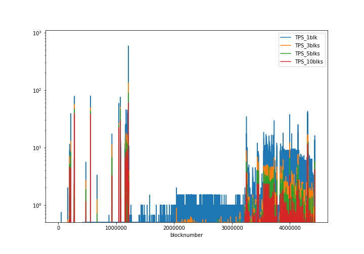

# analyze historical blocks
In this case, the "Tobalaba" chain of the energywebfoundation. 

## prep
All happens in virtualenv (see [../quorum.md#virtualenv](../quorum.md#virtualenv)).

Start virtualenv, install dependencies:
```
source env/bin/activate
pip3 install web3 pandas jupyter ipykernel matplotlib 
ipython kernel install --user --name="Python.3.py3eth"
```

## step 0: sync
Sync the chain. Possibly with `archive` flag on:

```
cd energywebfoundation_energyweb-client
./target/release/parity --pruning=archive --geth --chain tobalaba --rpcapi "web3,eth,personal" --db-compaction=ssd --cache-size=2048
```
It took about ~3 hours for syncing the >3 million transactions in the >4 million blocks of the "Tobalaba" chain.


## step 1: create DB
Parity is slow to query.

So we first extract all block information data, and dump it into an SQLite database.

```
python3 blocksDB_create.py
```

TODO: Is the parity RPC server really single-threaded? Would perhaps the IPC connection be faster? But there is no `~/.local/share/io.ethereum.parity/jsonrpc.ipc`. How to [enable IPC](https://wiki.parity.io/Configuring-Parity) in Tobalaba-parity?

The 4.4 million blocks took 2.5 hours to extract:

> 4429200 blocks took 9431.95 seconds  
> execute & commit 4429200 SQL statements into DB took 40.71 seconds  
> TABLE blocks has 4429200 rows  
> MIN(blocknumber), MAX(blocknumber) = [(0, 4429199)]   

But now we have them in our sqlite3 database, blazing fast...

## step 2: analyze & visualize

Python Jupyter is a nice graphics enabled IDE to show tables, diagrams, etc inline that are created with Python pandas, numpy, matplotlib.
```
jupyter notebook --ip=127.0.0.1
```

then execute all cells in [blocksDB_analyze.ipynb](../reader/outdated/blocksDB_analyze.ipynb)

Actually, the gitlab rendering of that ^ file is not bad,
so (even though it blows up the filesize),
I kept the results, incl all tables and diagrams, in that file.  
(Scroll down to approx the middle of the file, to see results).

## results
```
blocknumber_max               4392279
blocksize_max                 118,576 bytes
txcount_max                   1,179 transactions in block 1,210,825
txcount_sum                   3,313,470 transactions in total
txcount_average               0.754 transactions per block
blocks_nonempty_count         1,951,767
average txcount per nonempty blocks =  1.698
```
That biggest block is block 1,210,825 - see [block explorer](https://tobalaba.etherscan.com/block/1210825).
### TPS = transactions per second:  




**For many more such diagrams, see** [blocksDB_analyze.ipynb](../reader/outdated/blocksDB_analyze.ipynb).  
SCROLL DOWN TO THE MIDDLE OF THAT FILE.

some images are also in [img/](img)

## notes

### are the transactions actually executed successfully (or are they failing)

open a JSRE console to one of the nodes:
```
geth_quorum attach http://localhost:22001
```
then query example transaction (here tx 11 in block 55):
```
blockheight=55; index=10; 
txid=eth.getBlock(blockheight)["transactions"][index]; 
console.log(eth.getTransactionReceipt(txid)["gasUsed"], eth.getTransaction(txid)["gas"])

26691 90000
```
If `gasUsed != gas` then the transaction got executed.

